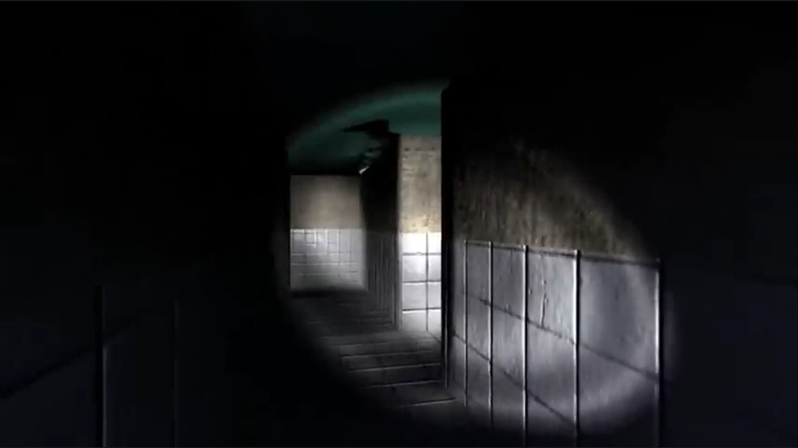
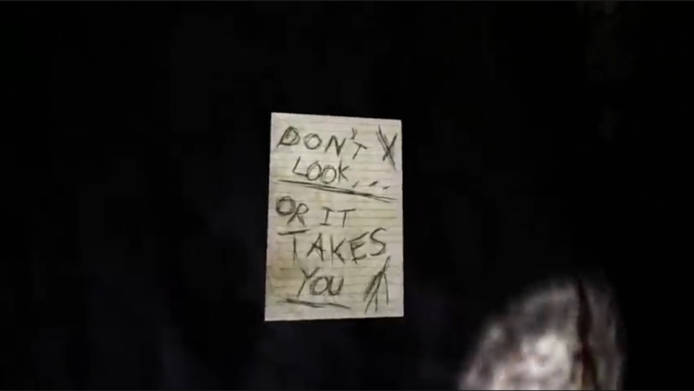
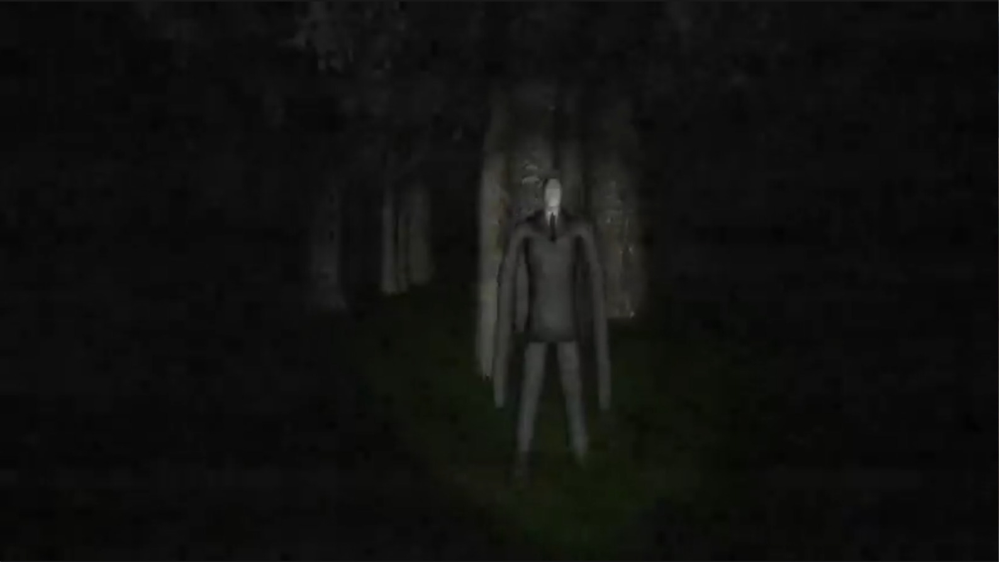

# Especificação da Implementação

> [!CAUTION]
> - Você <ins>**não pode utilizar ferramentas de IA para escrever esta
>   especificação**</ins>

> [!WARNING]
> - Após a entrega da primeira versão completa, esta especificação não
>   poderá ser alterada. A implementação final deverá corresponder ao que
>   estiver descrito neste arquivo.

## Integrantes da dupla

- **Aluno 1 - Nome**: Guilherme Guimarães Amaro da Silveira
- **Aluno 1 - Cartão UFRGS**: 587312

- **Aluno 2 - Nome**: Eduardo Altmann de Bem
- **Aluno 2 - Cartão UFRGS**: 594993

## Detalhes do que será implementado

- **Título do trabalho**: Slenderman Clone
- **Parágrafo curto descrevendo o que será implementado**: 
Clone do jogo Slenderman: Eight Pages. Será implementado todo o fluxo
do jogo; desde a tela inicial até os finais possíveis. As tecnologias usadas
serão Rust e WebGPU.

## Especificação visual

### Vídeo - Link

> [!IMPORTANT]
> - Coloque aqui um link para um vídeo que mostre a aplicação gráfica
>   de referência que você vai implementar. **Sua implementação deverá
>   ser o mais parecido possível com o que é mostrado no vídeo (mais
>   detalhes abaixo).**
> - **Você não pode escolher como referência: (1) algum trabalho realizado
>   por outros alunos desta disciplina, em semestres anteriores. (2) Minecraft.**
> - Por exemplo, você pode colocar um vídeo de um jogo que você gosta,
>   e seu trabalho final será uma re-implementação do jogo.
> - O vídeo pode ser um link para YouTube, Google Drive, ou arquivo mp4 dentro
>   do próprio repositório. Mas, garanta que qualquer um tenha
>   permissão de acesso ao vídeo através deste link.

https://www.youtube.com/watch?v=0BswJKtn_9o

### Vídeo - Timestamp

> [!IMPORTANT]
> - Coloque aqui um **intervalo de ~30 segundos** do vídeo acima, que
>   será a base de comparação para avaliar se o seu trabalho final
>   conseguiu ou não reproduzir a referência.

- **Timestamp inicial**: 0:21
- **Timestamp final**: 0:51

### Imagens

> [!IMPORTANT]
> - Coloque aqui **três imagens** capturadas do vídeo acima, que você
>   irá usar como ilustração para as explicações que vêm abaixo.
> - As imagens devem estar armazenadas neste repositório, no diretório
>   `images/spec/`, com os nomes `image1`, `image2` e `image3`.
> - Cada imagem deve usar o formato `.jpg` ou `.png`. Ajuste a extensão
>   nos vínculos abaixo para que corresponda ao arquivo armazenado.
> - Escolha imagens que correspondam a momentos do intervalo indicado
>   acima ou que sejam relevantes para a comparação com a implementação.

#### Imagem 1

- **Descrição**: Visão dos corredores internos da construção.

#### Imagem 2

- **Descrição**: Uma das páginas que o jogador precisa coletar.

#### Imagem 3

- **Descrição**: O próprio antagonista 'Slenderman' encarando o jogador.

## Especificação textual

Para cada um dos requisitos abaixo (detalhados no [Enunciado do Trabalho final - Moodle](https://moodle.ufrgs.br/mod/assign/view.php?id=6302370)), escreva um parágrafo **curto** explicando como este requisito será atendido, apontando itens específicos do vídeo/imagens que você incluiu acima que atendem estes requisitos.

### Malhas poligonais complexas
O mapa inclui modelos poligonais complexos, como carros, árvores, e o antagonista.

### Transformações geométricas controladas pelo usuário
O usuário poderá abrir e fechar portas e pegar as páginas.

### Diferentes tipos de câmeras
Durante a tela inicial, teremos uma look-at camera orbitando pontos de interesse do mapa.
Durante a jogatina, o jogador possui uma câmera livre first-person.

### Instâncias de objetos
O mapa possui várias árvores que são instâncias do mesmo modelo e alguns outros objetos repetidos.

### Testes de intersecção
O jogador irá colidir contra objetos físicos (paredes, carros, árvores), e não poderá atravessá-los.

### Modelos de Iluminação em todos os objetos
O jogador possui uma lanterna que pode iluminar os objetos do mapa.

> Comentário Professor: Implementem normal mapping para detalhar visualmente as superfícies dos objetos quando iluminados pela lanterna. Esse efeito está presente na referência visual.

### Mapeamento de texturas em todos os objetos
Todos os objetos do mapa possuem texturas.

### Movimentação com curva Bézier cúbica
Faremos vagalumes no jogo que se movimentarão utilizando curvas Bézier cúbicas.

### Animações baseadas no tempo ($\Delta t$)
Todas as animações serão baseadas no delta t, como as folhas das árvores, portas abrindo e fechando,
movimentação do jogador etc.

### Funcionalidade extra obrigatória

> [!IMPORTANT]
> - Descreva a funcionalidade extra relacionada à Computação Gráfica
>   que será implementada.
> - Esta funcionalidade também deverá ser documentada no arquivo
>   `README.md` da entrega final.

O jogador poderá abrir e fechar portas, e objetos como janelas e poças
mostrarão o reflexo do mapa/jogador/camera.

> Comentário Professor: Não considerem a funcionalidade de abrir e fechar portas como a funcionalidade extra obrigatória. Vocês podem atender a esse requisito com a implementação de reflexos.

## Limitações esperadas

> [!IMPORTANT]
> - Coloque aqui uma lista de detalhes visuais ou de interação que
>   aparecem no vídeo e/ou imagens acima, mas que você **não pretende
>   implementar** ou que você **irá implementar parcialmente**.
> - Para cada item, **explique por que** não será implementado ou por
>   que será implementado parcialmente.

1. Modelo do Slenderman:
    O modelo do slenderman não será igual ao do jogo, pois não temos acesso ao modelo original.
    Portanto, iremos usar um modelo open-source ou criar o nosso modelo.
2. Mapa do jogo:
    Também não temos acesso ao mapa do jogo, então teremos que recriá-lo. Tentaremos deixar o mapa
    o mais fiel possível, mas talvez adicionemos alguns elementos para demonstrar melhor as funcionalidades
    do trabalho.
3. Páginas:
    As páginas não terão as mesmas ilustrações das originais. Faremos a nossa própria arte, ou pegaremos imagens
    do Google com as respectivas licenças, ou elas serão geradas por IA.
